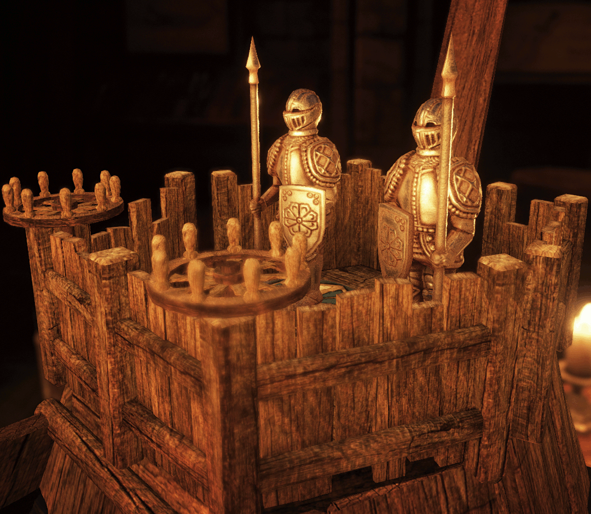

# SSAO

This is my SSAO algorithm implemented as a [SHADERed](https://github.com/dfranx/SHADERed) project (*using version 1.2.4*).

It uses low discrepancy noise to generate the sampling kernel (see [GenSamples.c](GenSamples.c)). Combined with enough spatial filtering (blur), this attempts to get low noise and high coverage even at lower sample counts. In comparison to other algorithms no noise texture is required, the randomized kernel is re-used instead.

Rendering is split into three passes:

1. Calculate SSAO
2. Filter X (and upsample if necessary)
3. Filter Y (and upsample if necessary)

### Settings

| Setting                 | Range                                                        |
| ----------------------- | ------------------------------------------------------------ |
| radius                  | `any` (SSAO radius in world units)                           |
| radius limit (optional) | `any` (this limits the maximum SSAO radius to a fixed screen %; it could be hardcoded, aswell) |
| sample count            | `1` to `16` per pixel, no preset steps                       |
| resolution              | `full` or `half` (half: width / 2, height / 2; so 1/4 of the pixels) |
| spatial filter size     | `5x5`, `7x5` or `7x7` (`3x3` is also possible, but maybe too low) |
| spatial filter limit    | `depth` or `depth & normal` (this limits the bilateral blur; using a `normal` limit only works too, but is not very practical) |

For the most part, preprocessor definitions and shader constants can be used to pass these settings to the shaders as they don't change during runtime.

### Resolution

The algorithm can operate at both half and full resolution. In the half-res scenario the rendertargets require the correct sizes:

| Pass          | RT Dimensions             | Format |
| ------------- | ------------------------- | ------ |
| SSAO Generate | `(width / 2, height / 2)` | `R8`   |
| SSAO Filter X | `(width, height / 2)`     | `R8`   |
| SSAO Filter Y | `(width, height)`         | `R8`   |

When rendering at full resolution, all targets are the same size `(width, height)`. Depending on the renderer, the last rendertarget can be skipped if SSAO is applied in the same pass.

### Required inputs

- Depth buffer
- Normal buffer

### Further improvements

- Realism wasn't the main priority as it's difficult with such little sample counts.
- I'm not too happy with the spatial filtering / upscaling. Haloing may also be an issue.
- There might be better distributions for the samples.
- Temporal filtering can push the quality by dithering over time (already tested).

----

Here's a comparison shot of the algorithm. It is injected into a game (*The House of da Vinci*) using custom shaders in [*ReShade*](https://github.com/crosire/reshade):

*on/off-comparison using 6 samples per pixel at half resolution*
